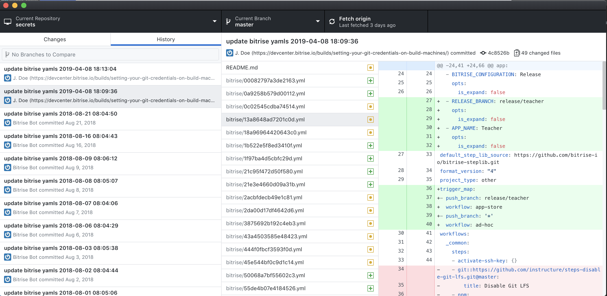

# BackupBitriseYamls

## Objective

All workflows should be backed up to an encrypted git repository.



## Solution

The [Keybase client](https://github.com/keybase/client) provides a cloud encrypted git repo.
Using the bitrise API, all YAMLs are fetched and then committed to the keybase git repo.
See [BackupBitriseYamls.kt][1] for the full source. Note that you should create a paper key when using keybase.
Otherwise if the device you installed keybase on is lost, you won't be able to login anymore.
 
```kotlin
override fun execute() {
    val apps = BitriseApps.getAppsForOrg()
    val appsMap = appsMap(apps)
    val repo = keybaseRepo()
    writeYamls(repo, apps)
}
```

[1]: https://github.com/instructure/canvas-android/blob/f455db88520d37be007af2f7b9e36d17e45182f5/automation/cloud_build_metrics/src/main/kotlin/tasks/BackupBitriseYamls.kt

The update happens in a scheduled nightly job on Bitrise using this workflow:

```yaml
prepare_keybase:
    envs:
    - KEYBASE_PAPERKEY: ...
      opts:
        is_expand: false
    - KEYBASE_USERNAME: ...
      opts:
        is_expand: false
    steps:
    - script:
        inputs:
        - content: |
            #!/bin/bash
            set -e

            if [ ! -d keybase ]; then
              echo "Downloading keybase..."
              curl --silent --output keybase.deb https://prerelease.keybase.io/keybase_amd64.deb
              echo "Installing keybase deb"
              mkdir keybase
              set +e
              dpkg -i keybase.deb
              apt-get install -f
              dpkg -i keybase.deb
              set -e
            else
              echo "Keybase exists!"
            fi
        title: Keybase - Download
    - script:
        inputs:
        - content: |
            #!/usr/bin/env bash
            set -ex

            export KEYBASE_ALLOW_ROOT=1

            keybase version
            keybase oneshot
        title: Keybase - Login
    - script:
        inputs:
        - content: |-
            #!/usr/bin/env bash
            set -ex

            git clone keybase://team/team/secrets ../../../secrets
        title: Keybase - git clone repo
BackupBitriseYamls:
    after_run: []
    before_run:
    - setup_workflow
    - prepare_keybase
    steps:
    - gradle-runner:
        inputs:
        - gradle_task: clean fatJar
        - gradle_file: "$BITRISE_SOURCE_DIR/automation/cloud_build_metrics/build.gradle.kts"
        - gradlew_path: "$BITRISE_SOURCE_DIR/automation/cloud_build_metrics/gradlew"
        - cache_level: all
    - script:
        inputs:
        - content: |
            #!/bin/bash
            set -euxo pipefail
            java -version
            java -jar "$BITRISE_SOURCE_DIR/automation/cloud_build_metrics/build/libs/cloud_build_metrics-all-1.0-SNAPSHOT.jar" BackupBitriseYamls
        title: Backup Bitrise Yamls
    - script:
        inputs:
        - content: |
            #!/usr/bin/env bash
            set -ex

            if [[ -n $(git -C ../../../secrets status -s) ]]; then
                DATE=`date '+%Y-%m-%d %H:%M:%S'`
                git -C ../../../secrets add .
                git -C ../../../secrets commit -m "update bitrise yamls $DATE"
                git -C ../../../secrets push
            fi
        title: Keybase - git commit & push
```
