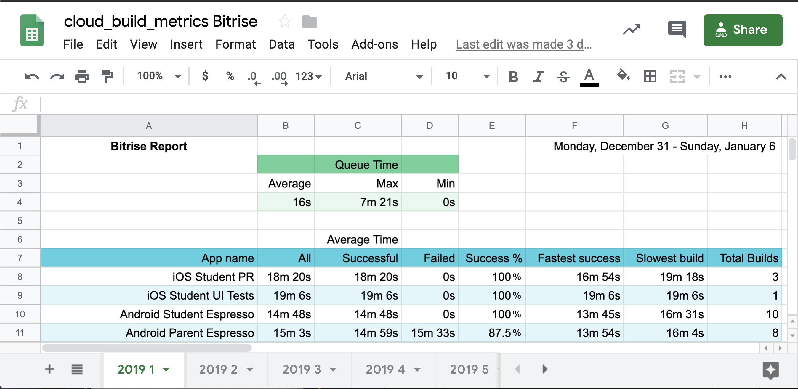

# SprintReport

## Objective

Provide sprint level insight into build health



## Solution

In addition to Data Studio for aggregated summary build health, there’s a need for understanding how every job is 
doing on the platform. The SprintReport tasks generates a color coded Google Sheet with statistics for the week about 
every job that executed. The sprint report has been instrumental in identifying jobs that need help. A number of bugs
in the infrastructure on bitrise were found due to this reporting. It’s great to bring data into conversations with 
vendors to help provide clarity around the best way to resolve a problem. The per job data helps ensure that the fixes 
we’re making have a measurable impact on performance and stability.

```kotlin
override fun execute() {
    uploadBuildReport(BitriseQuery)
}
```

See [SprintReport.kt][1] for the full source.

[1]: https://github.com/instructure/canvas-android/blob/f455db88520d37be007af2f7b9e36d17e45182f5/automation/cloud_build_metrics/src/main/kotlin/tasks/SprintReport.kt
