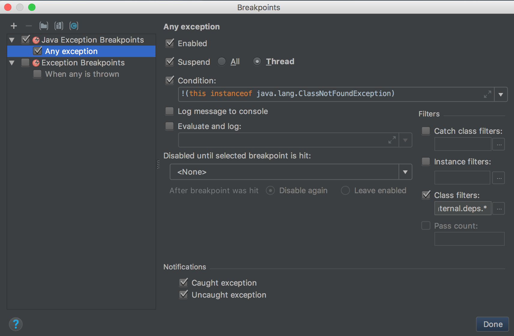
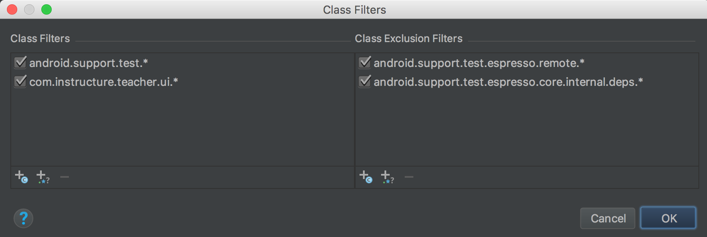

# Debugging Flaky Android Tests

Wrap the test in `repeat(100) { ... }`

```kotlin
    @Test
    fun removeOverride() {
        repeat(100) {
            mActivityRule.launchActivity()
            getToEditQuizDetailsPage()
            editQuizDetailsPage.clickAddOverride()
            assigneeListPage.saveAndClose()
            editQuizDetailsPage.assertNewOverrideCreated()
            editQuizDetailsPage.removeFirstOverride()
            editQuizDetailsPage.assertOverrideRemoved()
        }
    }
```

In Android Studio, select `Run → View Breakpoints...`
Configure Java Exception Breakpoints as shown.

Use a condition to filter out missing classes:

> !(this instanceof java.lang.ClassNotFoundException)

Class Filters

- `android.support.test.*`
- `com.instructure.teacher.ui.*`

Class Exclusion Filters

- `android.support.test.espresso.remote.*`
- `android.support.test.espresso.core.internal.deps.*`





Now run the test locally and Android Studio will pause the app when Espresso fails.
