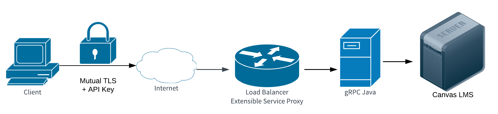
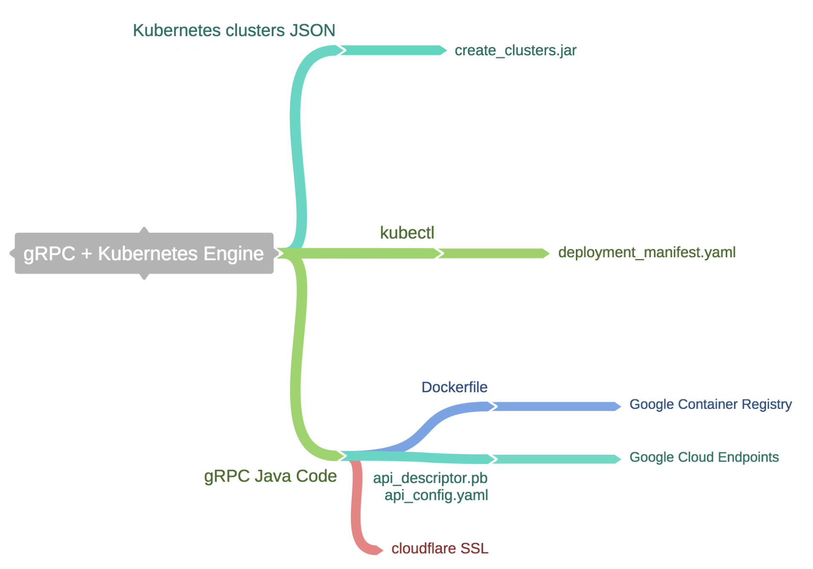

## SoSeedyGRPC

SoSeedy gRPC project.

Data seeding is a project that enables our mobile UI automated tests to run successfully on Google’s Firebase Test Lab service. Data seeding is responsible for creating the courses, teachers, and other state necessary to fully test the apps.

<!-- update pngs to svgs after repo is public
https://github.com/github/markup/issues/556#issuecomment-399336652  -->

# Technology

* [gRPC](https://grpc.io/)
    * [gRPC Java](https://github.com/grpc/grpc-java)
    * [gRPC Swift](https://github.com/grpc/grpc-swift)
* [Kubernetes Engine](https://cloud.google.com/kubernetes-engine/)
* [Cloud Endpoints](https://cloud.google.com/endpoints/)
    * [Extensible Service Proxy](https://github.com/cloudendpoints/esp)
* [CFSSL](https://github.com/cloudflare/cfssl)
* [Docker](https://www.docker.com/)
    * [Container Registry](https://cloud.google.com/container-registry/)
    * [Distroless](https://github.com/GoogleContainerTools/distroless)

# Overview

* Kubernetes [cluster JSON][1] is used by create_clusters.jar to create the cluster
* kubectl is used to deploy into the cluster via deployment_manifest.yaml
* Java code is compiled into a Dockerfile and uploaded to Google Container Registry
* protobuf description is uploaded to Google Cloud Endpoints
* SSL certs are generated via cloudflare SSL

Mutual TLS is used to communicate with the nginx based [Extensible Service Proxy.][2] An [API key][3] scoped to the data seeding project is used to authenticate all requests.

# Bitrise

[SoSeedy Kubernetes][4]

- _before
  - Clones repo
  - Authenticates to Google cloud
- _kubectl
  - Installs kubectl
  - Fetches kubectl credential via gcloud
- [create_cluster][5]
  - Builds & runs cluster_create.jar
  - Sends POST request with JSON from [clusters.txt][6]
- [update_cloud_endpoints][7]
  - Builds and runs api_config.jar
  - Generates [api_config.yaml][8] by parsing protobuf files with [square/wire][9]
  - Runs [gcloud_endpoints.sh][10]
    - Runs generateProto gradle task in `dataseedingapi`
    - Gradle protobuf plugin creates API descriptor file
    - gcloud updates endpoints deployment with api descriptor and api_config.yaml
- [update_pod][11]
  - Uploads cfssl certs to kubernetes via [create_secret.sh][12]
  - Deletes and creates a new deployment via [deployment_manifest.yaml][13]
- [update_docker_image][14]
  - Builds soseedy docker image from [Dockerfile][15] using distroless java
  - Pushes soseedy docker image to the Google Container Registry
- _after
  - Updates Bitrise cache

[1]: ../cluster_create/clusters.txt
[2]: https://github.com/cloudendpoints/esp
[3]: https://console.cloud.google.com/apis/credentials/key/105?project=delta-essence-114723&folder&organizationId
[4]: https://app.bitrise.io/app/e9c6ceb79d273cb2#/builds
[5]: https://app.bitrise.io/build/7c9d0fe2936fa86a
[6]: ../cluster_create/clusters.txt
[7]: https://app.bitrise.io/build/c9e30567be771d1a
[8]: ../dataseedingapi/api_config.yaml
[9]: https://github.com/square/wire
[10]: ../dataseedingapi/gcloud_endpoints.sh
[11]: https://app.bitrise.io/build/91acb65b1819ab87
[12]: ../dataseedingapi/create_secret.sh
[13]: ../dataseedingapi/deployment_manifest.yaml
[14]: https://app.bitrise.io/build/ea50792c63242d46
[15]: ../soseedygrpc/Dockerfile
