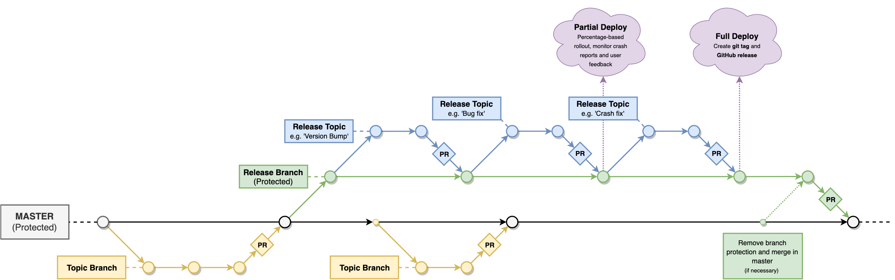

# Git Workflow

1. **Master branch**  
    There is only one historical branch - the master branch. The master branch does not necessarily need to be deployable after every merge, as deployment will occur in release branches.
    
2. **Normal branches**, aka topic branches or feature branches  
    Normal change/topic/feature branches should branch directly from, and merge into, the master branch (with the exception of release topics - see 3c). The workflow for normal branches is thus: 
    1. Create a new branch from master. Use the naming convention specified below.
    2. Create and commit changes. Try to keep one commit per feature/change to reduce clutter during code reviews.
    3. When ready to merge, create a Pull Request with master as the base branch.
    4. Code must be reviewed and approved by at least one non-author. When applicable, the reviewer should manually test the changes and/or verify that adequate tests are in place.
    6. Once approved, proceed to merge the changes. The preferred merging method, if available, is *Squash and merge*. This cuts down on the number of merge commits and reduce noise in the git history compared to a regular merge.
    7. Delete the branch.

3.  **Release branches**  
    Releases are achieved using release branches:
    1.  Initiate the release process by creating a new release branch from master. Use the naming convention specified below.
    2.  Push and protect this branch. There should be no commits directly to this branch until the release is in production. This must happen before the remaining steps to ensure that other developers can access the branch.
    3.  For any changes (version bump, update translations, bug fix, etc), create a new topic branch from this release branch, using the naming convention specified below.
    4.  When changes are complete, this topic branch should be merged back into the source release branch via Pull Request, after proper Code Review, and then deleted.
    5.  When a release is ready for final testing, use the appropriate workflow in the CI service to generate a release candidate APK from the head of the release branch and test appropriately.
    6.  When ready to deploy to production, use the appropriate workflow in the CI service to generate and upload a release APK to the internal Google Play test track. This will add the APK to the artifact library and will deploy the release to internal users who require early access to the release (e.g. the documentation team).
    7.  A developer should then manually initiate a new release in the Google Play console, using the APK uploaded in during the prior step, and begin rollout to a small subset of users (5-10%).
    8.  If no blocking issues are discovered during the rollout, the rollout percentage may be incrementally increased.
    9.  If issues are discovered during rollout, repeat the previous steps as necessary while bumping the version code (not the version name) for each new release.
    10.  Once rollout reaches 100% and the release is considered complete, create a git tag and GitHub release based on the head of the release branch. Follow the naming convention specified in the next section.
    11. The release branch can now be merged back into master via Pull Request. If many changes have occurred on master since the release branch was created, it may be necessary to unprotect the branch, merge in master, and resolve any merge conflicts first.
    12.  Once merged, unprotect and delete the release branch.  
    
4.  **Branch Naming Conventions**  
    - **Normal branches** - It is suggested that normal branch names include the associated project name and ticket number, where applicable, and optionally a few words describing the purpose of the branch.  
        *Examples:* `parent/MBL-1234`, `MBL-1234-update-rating-dialog`, `fix-teacher-release-crash`
    
    - **Release branch** - Release branches may be used in automated workflows and must therefore follow a strict naming convention: *release/{project}/{version_name}*  
        *Example:* `release/parent/1.1.0`
    
    - **Release topic branches** - Topic branches that will be merged into release branches should follow the same convention as normal branches, with the optional addition of release target info.  
        *Examples:* `release/parent/1.1.0-proguard-fix`, `student-version-bump`, `teacher-1.1.0-crash-fix`
    
    - **Production Release Tag** - Release tags should strictly follow this convention:  
        *{project}-{version_name}-{version_code}*  
        *Example:* `parent-1.1.0-5`

5.  **Pull Request message tags**   
    Example:  `[project][MBL-0000] This is my PR message`  
    Adding tags to your Pull Request messages helps provide information that will be useful for both reviewers and for future developers (including yourself). Tags take the form of one or two short words surrounded by square brackets, and should be added at the beginning of the first line of the PR message. These are the primary tags you'll be using:  
      
    - **Ticket Number:** If your PR has an associated JIRA ticket/issue, make sure to include the ticket number as a tag in the PR message.  
    *Example:* `[MBL-1234] Adds a new feature`
    
    - **Project name:** One of the few downsides of hosting a monorepo with Git is the commit noise; when attempting to view the history for a single project it can be difficult to filter out unrelated commits. To help mitigate this issue, you should add a tag with the name of the project or library your changes apply to.  
    *Example:* `[Student][MBL-1234] Adds Course list fragment`
    
    - **Work in Progress:** When you want someone to do a preliminary code review of you changes, or just need to create a PR before your changes are fully ready, add a [WIP] tag. This tells other developers not to spend any time reviewing your code unless you ask them to. When your code is finally ready, make sure to update the PR message and remove the [WIP] tag before merging.    
    *Example:* `[WIP] Testing out some changes`  
      
    - **Skip CI**: Often when your code is a work in progress you don't need to trigger Continuous Integration builds for your changes. If you want to skip these builds for your WIP PR and free up CI resources for other active PRs, add the [skip ci] tag. Like the [WIP] tag, make sure to remove this tag when your changes are complete.  
    *Example:* `[WIP][skip ci] Testing out some changes`  
    
     - **Release Target**: If the pull request will be merged into a release branch, it is suggested that you add a tag for the project name (see above) as well as a release target tag that specifies the release version, in the form of [R-#.#.#]  
    *Example:* `[Teacher][R-1.8.1] Fix dashboard regression` 
    
6.  **Misc**  
    To maintain SOC 2 compliance, no code should ever be committed directly to the master branch. All changes must be pushed to topic branches and merged via Pull Request after proper Code Review and QA. This also applies to release branches where possible, particularly for commits made prior to 100% deployment.

    Generally, a topic branch should only belong to the developer who created it. In cases where multiple developers must commit to the same branch, ensure that you do not rebase pushed commits. Things will get messy.
    
    For Pull Requests, CI should always build projects which consume libraries that have changed, even for PRs on release branches. This reduces the likelihood of accidental breakage.
    
## Visual workflow example

